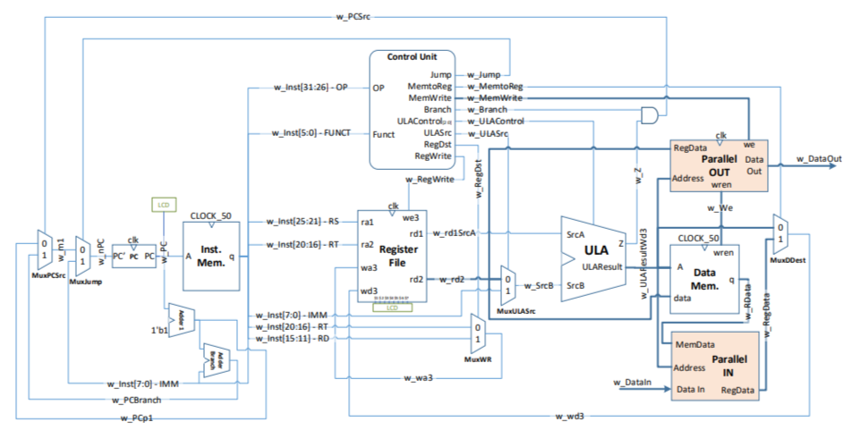

# Projeto final da disciplina de Arquitetura de Sistemas Digitais


## Índice
- [Plano de Verificação](#Plano-de-Verificação)
- [CPU V1.0](#CPU-V-1.0)
- [Recursos](#Recursos)
- [Simulação](#Simulação)
- [Autor](#Autor)
- [Licença](#Licença)

## Descrição

```
Projeto de um processador MIPS de ciclo único com instruções em Assembly utilizando FPGA Altera DE2.
```

## Design CPU V1.0
Design da versão final da CPU.



## Recursos:

```
FPGA Altera DE2

Intel Quartus Prime II 13.0
```

## Autor

* **André Medeiros** - [André Medeiros](https://github.com/andreemedeiros)

Contribuição no projeto [CPU MIPS](https://github.com/andreemedeiros/CPU-MIPS/graphs/contributors).

## Licença

Este projeto está licenciado sob a MIT License - veja a [LICENSE.md](LICENSE.md) para mais detalhes.
